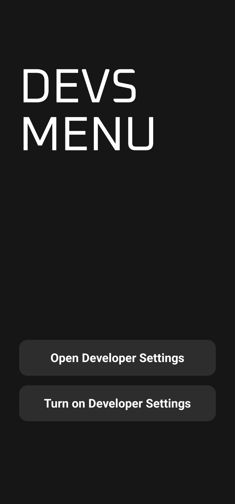

<h1>Devs Menu</h1>

A simple Android app that provides quick access to Developer Options on Android devices. This app serves as a useful tool for developers who need to navigate to various settings quickly.

It is a personal project for me as I need to turn on wireless debugging every day, and it’s a hassle to go into the settings, so I made this app for convenience.

## Features

- Displays a simple user interface with the title "DEVS MENU".
- Provides buttons to open the Developer Settings and Device Info Settings.
- Includes a homescreen widget for quick access to settings.
- Uses a custom font for a better visual appearance.
- Supports edge-to-edge display for a modern look.

## Screenshots



## Tech Stack

- **Kotlin**: Programming language for Android development.
- **Jetpack Compose**: UI toolkit for building native Android UI.
- **Android SDK**: Development kit for Android applications.

## Getting Started

### Prerequisites

- Android Studio installed on your machine.
- Basic knowledge of Android development.

### Installation

1. Clone the repository:

   ```bash
   git clone https://github.com/A-man404/Devs-Menu.git


### Download Apk

You can download the latest version of the app from the [Release v1.1](https://github.com/A-man404/Devs-Menu/releases/tag/v1.1).
